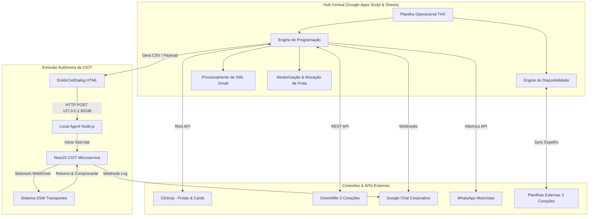
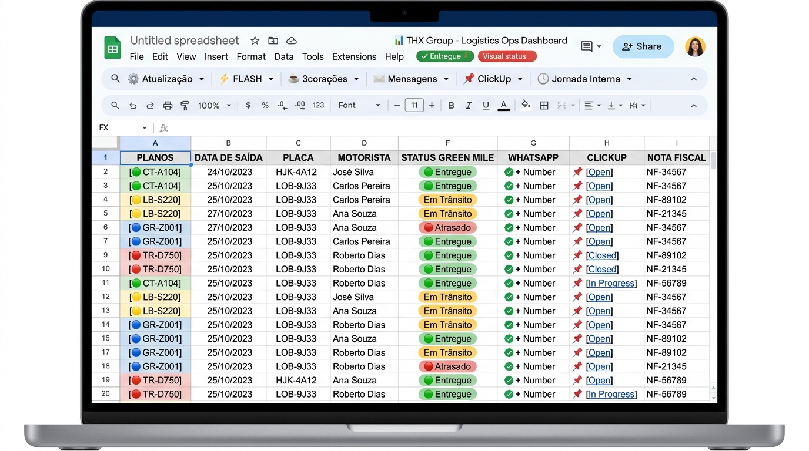
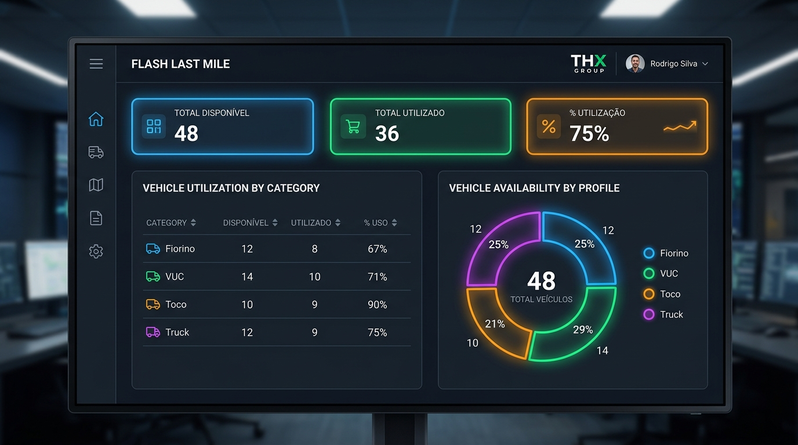
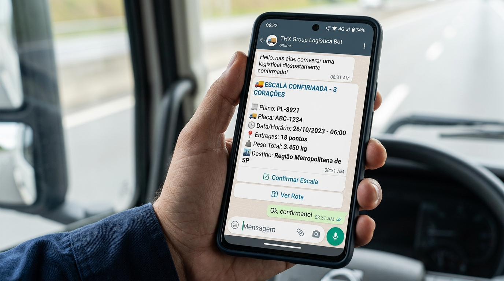
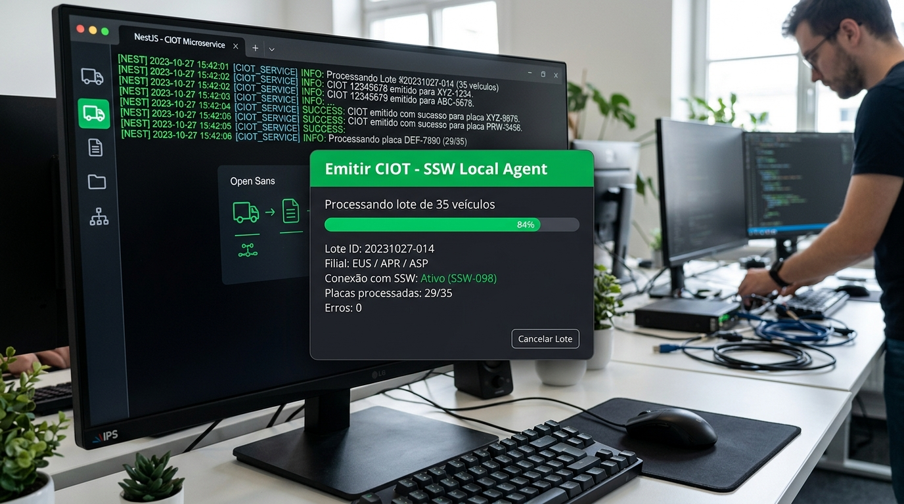

<div align="center">


# 🚚 THX Group | Sistema de Programação, Disponibilidade & Automação Logística

**Hub Integrador de Operações Logísticas, Roteirização, Comunicação com Motoristas e Emissão Automatizada de CIOT**

[](https://developers.google.com/apps-script)
[](https://nestjs.com/)
[](https://www.typescriptlang.org/)
[](https://www.selenium.dev/)
[](https://clickup.com/)
[](https://www.whatsapp.com/)

</div>

---

## 📌 Visão Geral da Solução

O **Sistema de Programação e Disponibilidade THX Group** é um ecossistema corporativo completo de orquestração logística projetado para centralizar, automatizar e acelerar a operação de transporte de distribuição, com foco na operação de alta complexidade de clientes como **Café 3 Corações**, **Guarulhos**, **Sumaré** e filiais regionais.

A solução unifica:
- **Google Sheets & Google Apps Script**: Hub centralizador da planilha de operações diárias, com menu operacional personalizado e rotinas em background.
- **Integração GreenMile (GM7)**: Extração de planos de entrega, restrições e sequenciamento de rotas.
- **ClickUp API**: Sincronização bidirecional de motoristas, controle de frotas e criação automática de cartões de viagem estruturados.
- **Disparo Automatizado via WhatsApp (Attemics / Chatwoot)**: Notificação instantânea para os motoristas sobre confirmações de escala e romaneios completos com endereço, peso e valor.
- **Torre de Controle FLASH LAST MILE**: Dashboard executivo responsivo em tempo real e disparos de passagens de turno no Google Chat via Webhooks.
- **Emissão Automatizada de CIOT (SSW)**: Microserviço autônomo baseado em NestJS e Selenium WebDriver para preenchimento e homologação de CIOT no sistema SSW de transporte sem intervenção manual repetitiva.

---

## 🏗️ Arquitetura do Sistema



---

## 📸 Funcionalidades e Prints do Sistema

### 1. ⚙️ Painel de Controle Operacional (Google Sheets Custom Menu)

A interface operacional em Google Sheets é potencializada por um menu nativo estendido que centraliza todas as ações de planejamento de carga e rotas em cliques únicos:



#### Recursos do Menu:
* **⚙️ Atualização**:
  * `🚚 Atualizar Programação`: Sincroniza dados da planilha matriz de rotas, ativando/desativando loops automáticos time-based.
  * `📋 Atualizar Disponibilidade (ClickUp)`: Cruza dados de motoristas e veículos cadastrados no ClickUp atualizando a aba de disponibilidade diária.
  * `🎲 Aleatorizar Placas`: Algoritmo inteligente que distribui veículos por tipo e rota evitando vícios operacionais de alocação.
* **☕ 3corações**:
  * `Sincronizar Disponibilidade (Padrão D, I, P)`: Mapeamento em tempo real de status (*Disponível*, *Indisponível*, *Programado*) refletido instantaneamente na planilha externa do cliente.
  * `📋 Reportar Placas`: Consolidação de placas ativas para envio operacional à fábrica.
  * `✉️ Solicitar inclusão GM7`: Notificação para liberação de acessos no sistema GreenMile.
  * `✉️ Cobrança e Processamento de XML`: Monitor em segundo plano que identifica anexos XML de Notas Fiscais no Gmail, faz a leitura de chave, romaneio e valor e abastece a planilha.
* **🕒 Jornada Interna**:
  * Acompanhamento de horários de início, pausa, retorno e término da jornada de trabalho de cada condutor e ajudante.

---

### 2. ⚡ Torre de Controle FLASH LAST MILE & Passagens de Turno

O sistema possui uma torre de controle visual integrada para acompanhamento instantâneo da capacidade operacional do centro de distribuição de Guarulhos e outras unidades:



#### Recursos do Módulo Flash:
* **Dashboard Executivo Responsivo (`FlashDashboard.html`)**:
  * Indicadores de topo: **Total Disponível**, **Total Utilizado** e **% de Ocupação de Frota**.
  * Farol de calor semafórico dinâmico (🟢 Verde <40%, 🟡 Amarelo 40-70%, 🟠 Laranja 70-90%, 🔴 Vermelho ≥90%).
  * Quebra detalhada por categoria veicular: *Fiorino, VUC, Toco, Truck e Carreta*.
  * Gráfico de rosca (Donut Chart) com distribuição percentual por perfil de caminhão.
* **Passagens de Turno Instantâneas via Google Chat**:
  * Disparos automáticos e sob demanda via Webhook com payloads em formato Card V2 para salas de operações:
    * `📱 Passagem de Turno: Programação`
    * `🏭 Passagem de Turno: Jornada Interna`
    * `🔵 Passagem de Turno: Disponibilidade`

---

### 3. ✉️ Notificação & Despacho Inteligente via WhatsApp (Attemics / Chatwoot)

Comunicação ágil e sem atrito diretamente com os condutores da ponta através de bots de mensageria com fila de segurança e controle anti-spam:



#### Estratégia de Mensagens em Duas Etapas:
1. **1ª Mensagem (Confirmação de Escala)**:
   * Notifica o motorista da existência de carga designada para ele no dia seguinte.
   * Solicita confirmação de presença e prontidão para carregamento.
2. **2ª Mensagem (Romaneio Completo de Carga)**:
   * **Plano de Viagem / Rota** e **Placa Vinculada**
   * **Horário e Faixa de Agenda de Coleta**
   * **Senha ou Protocolo de Carregamento**
   * **Quantidade de Entregas & Pontos de Parada**
   * **Peso Total (kg)** e **Valor Total Transportado (R$)**
   * **Cidades e Bairros de Destino**
* **Mecanismos de Segurança**:
  * Trava de concorrência (`LockService`) com timeout inteligente.
  * Delay configurável entre mensagens (2 segundos) para preservação de números contra banimento.
  * Modo de teste seguro (`TEST_MODE`) para validação de layout antes de envios em lote de produção.

---

### 4. 📑 Emissão Autônoma de CIOT (SSW Transportes)

Automação ponta a ponta do fluxo burocrático de emissão do **Código Identificador da Operação de Transporte (CIOT)**, eliminando digitação manual em telas legadas:



#### Fluxo Operacional:
1. **Interface Dialog no Google Sheets (`EmitirCiotDialog.html`)**:
   * O operador aciona o menu `Emitir CIOT`. A função em Apps Script varre a lista ou view configurada no ClickUp, extrai todas as tarefas elegíveis e gera um arquivo estruturado de remessa CSV.
2. **Agente Local HTTP (`ciot-local-agent.js`)**:
   * Escuta requisições na porta `30248`, recebe o lote CSV gerado pela nuvem e orquestra a chamada do executável local.
3. **Robô Headless NestJS + Selenium (`ssw-ciot-app-main`)**:
   * Efetua autenticação automatizada no portal SSW com domínio, usuário, CPF e senha.
   * Converte a unidade do pedido para a sigla correspondente da filial no SSW:
     * `Sumaré / Guarulhos` ➔ **EUS**
     * `Cambé / Curitiba / Ponta Grossa / Guarapuava` ➔ **APR**
     * `Regente Feijó / São José do Rio Preto / Catanduva` ➔ **ASP**
     * `Farroupilha` ➔ **ARS**
   * Preenche número do plano, dados da placa, condutor, valor da ficha de frete e submete a emissão do CIOT.
   * Registra resultado no log de auditoria e notifica a sala operacional no Google Chat.

---

## 🗂️ Estrutura do Repositório

```text
├── .clasp.json                  # Configuração do Clasp para deploy no Google Apps Script
├── .claspignore                # Arquivos ignorados no push do Apps Script
├── appsscript.json             # Manifesto de permissões e serviços OAuth do Google
├── Código.js                   # Módulo central: menus, integrações 3Corações, ClickUp, regras de negócio
├── EmitirCiot.js               # Lógica de integração e geração de lotes para o agente CIOT
├── EmitirCiotDialog.html       # Interface gráfica modal para acionamento do robô CIOT
├── FlashDashboard.html         # Template do dashboard web em tempo real (HTML5, CSS moderno, Donut Chart)
├── FlashLastMile.js            # Coleta de dados, KPIs de ocupação e montagem da aba FLASH LAST MILE
├── FlashPassagemTurno.js       # Formatador e despachante de passagens de turno no Google Chat
├── FlashWeb.js                 # Controller do WebApp do dashboard
├── Secrets.js                  # Camada de segurança para Secrets e sanitização de logs (redact)
├── Sync3Coracoes.js            # Sincronização direta com a planilha do cliente 3 Corações
├── chatWoot.js                 # Módulo de envio complementar via Chatwoot / Webhook
├── research_clickup.js         # Utilitários de pesquisa e mapeamento de campos na API do ClickUp
├── logo-thx.png                # Identidade visual corporativa da THX Group
├── docs/
│   └── prints/                 # Capturas de tela e prints de alta fidelidade das funcionalidades
│       ├── 01-flash-lastmile-dashboard.jpg
│       ├── 02-painel-google-sheets.jpg
│       ├── 03-disparo-whatsapp-escala.jpg
│       └── 04-emissao-ciot-ssw.jpg
└── ssw-ciot-app-main/          # Microserviço local de automação SSW CIOT
    ├── ciot-local-agent.js     # Servidor local Node.js (Porta 30248)
    ├── ciot-local-agent.bat    # Script de inicialização rápida do agente
    ├── package.json            # Dependências do NestJS e Selenium WebDriver
    ├── tsconfig.json           # Configurações do compilador TypeScript
    └── src/
        ├── app.module.ts       # Módulo raiz da aplicação NestJS
        ├── main.ts             # Bootstrap do microserviço
        └── ssw/
            ├── session-ssw.service.ts         # Gerenciamento de sessão e login no SSW
            └── services/
                └── emission-ciot-ssw.ts       # Robô Selenium para preenchimento de CIOT
```

---

## 🚀 Como Configurar e Executar

### 1. Google Apps Script
1. Instale o Google Clasp globalmente caso queira sincronizar via linha de comando:
   ```bash
   npm install -g @google/clasp
   clasp login
   ```
2. No painel do Google Apps Script, defina as variáveis de ambiente necessárias em **Configurações do Projeto > Propriedades do Script** (Script Properties):
   * `CLICKUP_TOKEN`: Token de autenticação da API ClickUp v2.
   * `ATTEMICS_TOKEN`: Token da API de envio de mensagens do WhatsApp.
   * `GREENMILE_USER` / `GREENMILE_PASS`: Credenciais de consulta de rotas do GreenMile.
   * `SSW_DOMINIO`, `SSW_CPF`, `SSW_USUARIO`, `SSW_SENHA`: Credenciais de acesso ao SSW.

### 2. Agente Local e Microserviço de CIOT
Para executar a automação de emissão de CIOT na máquina do operador de tráfego:

```bash
# Acesse o diretório do microserviço
cd ssw-ciot-app-main

# Instale as dependências
npm install

# Inicie o agente local receptor (escuta na porta 30248)
node ciot-local-agent.js
```

Ou simplesmente execute o atalho Windows:
```cmd
ciot-local-agent.bat
```

Quando o operador clicar em **Emitir CIOT** na planilha do Google, a requisição é transmitida localmente ao robô que abrirá o navegador em modo controlado e realizará a validação dos registros.

---

## 🔒 Segurança e Tratamento de Dados

* **Sanitização de Logs (`Secrets.js`)**: O código possui algoritmos com Regex (`redactString_`) que detectam e mascaram automaticamente senhas, tokens Bearer e chaves de API caso sejam impressos no `Logger` ou nas abas de auditoria.
* **Validação de Formulários**: Bloqueios preventivos contra submissão de frotas sem placa ou sem vínculo contratual ativo.

---

<div align="center">

**Desenvolvido com foco em excelência e eficiência operacional pela equipe THX Group** 🚀

</div>
